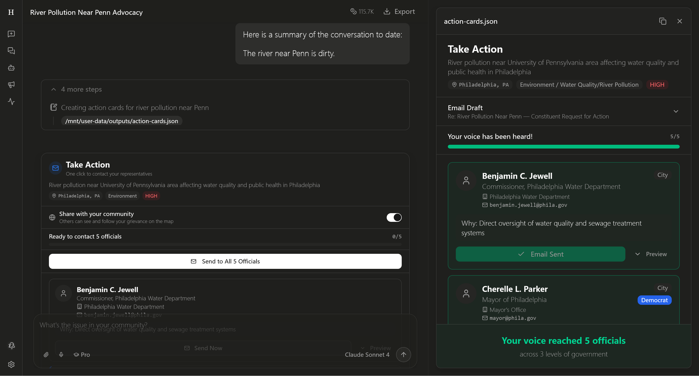
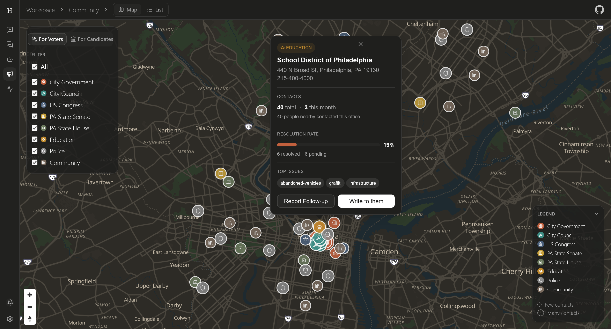
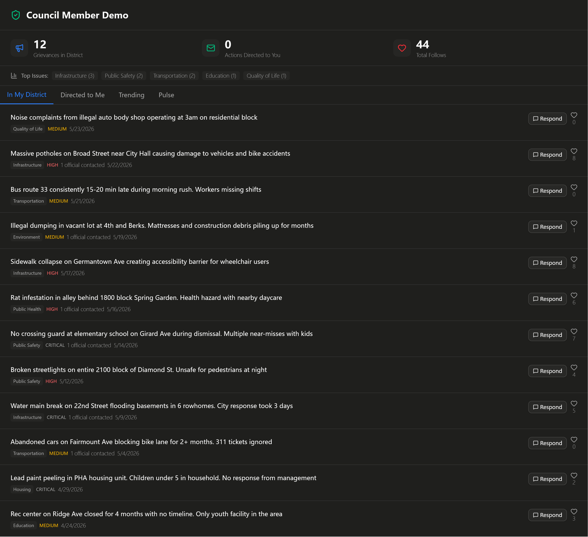
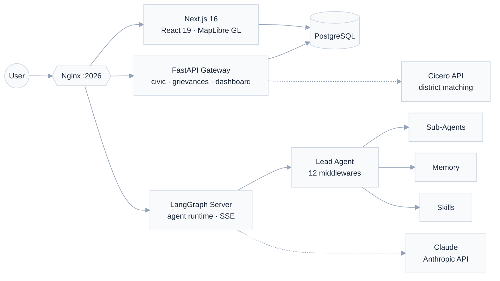

<div align="center">

# Heard

**Turn a personal grievance into political action, in 60 seconds.**

[](#)

[](./backend/pyproject.toml) [](./frontend/package.json) [](./backend/pyproject.toml) [](./backend/langgraph.json) [](./docker/docker-compose-dev.yaml) [](./LICENSE)

<br />


<br />

[Quick Start](#quick-start) &bull; [Features](#features) &bull; [Architecture](#architecture) &bull; [Tech Stack](#tech-stack) &bull; [Contributing](./doc/CONTRIBUTING.md)

</div>

---

## The Problem

Millions of Americans have legitimate grievances: potholes destroying bikes, lead paint in public housing, missing school crossing guards. But **no practical way to act on them**. Identifying which elected official has jurisdiction, drafting an effective constituent letter, and building community support requires expertise most citizens don't have.

**Heard closes that gap.** Type a grievance, provide your address, and Heard's multi-agent system produces a complete advocacy toolkit: root-cause analysis, affected-population estimate, elected-official power map, drafted communications, and a political strategy brief. Then contact every relevant official with one click.

---

## Features

### Describe your problem. Heard handles the rest.

Type "the river near Penn is dirty" and your address. Heard figures out who's responsible, from City Council to Congress, drafts a professional constituent email for each official, and lets you send them all with one click.

<p align="center"></p>

- **Issue triage** automatically classifies category, severity, and affected jurisdiction
- **Official lookup** matches 3 to 5 elected officials across city, state, and federal levels
- **Ready-to-send emails** personalized per official with real `.gov` addresses
- **One-click delivery** sends to all matched officials with a live progress tracker
- **Policy brief** on request with root-cause analysis, comparable precedents, and intervention recommendations

### See every issue in your city on one map.

All public grievances appear as color-coded dots on an interactive map. Click any government office to see its contact info, resolution rate, and the top issues constituents are reporting. Search and filter across the full feed.

<p align="center"></p>

- **Grievance map** plots every public issue as a color-coded dot by severity
- **Institution markers** show office address, phone, officeholder, and resolution rate
- **Filter by level** toggle between City Government, City Council, US Congress, PA State Senate, and more
- **Community feed** lists all grievances with full-text search, sorting by date or follower count
- **Follow button** lets citizens track issues they care about and get notified on updates

### Officials get a dashboard. Citizens get accountability.

Verified elected officials log in to see every grievance filed in their district, respond publicly, and track what their constituents care about most. Citizens see which officials are engaging and which aren't.

<p align="center"></p>

- **District overview** shows total grievances, actions directed to the official, and total follows at a glance
- **Category breakdown** surfaces top issues (Infrastructure, Public Safety, Housing, etc.) with counts
- **Tabs** split views into "In My District", "Directed to Me", "Trending", and "Pulse" analytics
- **Public responses** let officials reply directly on grievance pages, notifying every follower
- **Multi-level matching** ensures a state senator only sees state-level issues, not city council matters

---

## Architecture

<div align="center">



</div>

The agent runtime is built on a harness derived from [DeerFlow](https://github.com/bytedance/deer-flow) (ByteDance). It orchestrates a 12-stage middleware pipeline, concurrent sub-agents, persistent memory with LLM-based fact extraction, and sandboxed execution, all streaming over SSE to the frontend.

---

## Quick Start

### Docker (recommended)

```bash
git clone https://github.com/StevenWang-CY/Heard.git && cd Heard

# Set your API key
cp .env.example .env
# Edit .env and add ANTHROPIC_API_KEY (required) and CICERO_API_KEY

# Start everything (PostgreSQL, Gateway, LangGraph, Frontend, Nginx)
docker compose -f docker/docker-compose-dev.yaml up -d

# Open http://localhost:2026
```

All 5 services start automatically. PostgreSQL runs locally in Docker with no external database needed. Migrations and seed data apply on first boot.

<details>
<summary><strong>Local development (without Docker)</strong></summary>

**Prerequisites:** Python 3.12+, Node.js 22+, pnpm 10.26+, uv, nginx, PostgreSQL 14+

```bash
make check          # verify prerequisites
make install        # install all dependencies

cp .env.example .env
cp .env.development.example .env.development
cp config.example.yaml config.yaml

make dev            # start all services with hot-reload
# Open http://localhost:2026
```

| Command | Purpose |
|---------|---------|
| `make dev` | All services, hot-reload |
| `make stop` | Stop everything |
| `make doctor` | Diagnose config issues |
| `cd backend && make test` | Run backend tests |
| `cd frontend && pnpm check` | Lint + type check |

</details>

---

## Tech Stack

| Layer | Technology | Purpose |
|-------|-----------|---------|
| **Agent Runtime** | LangGraph + Claude (Anthropic) | Multi-agent orchestration, reasoning, tool use |
| **Backend API** | FastAPI, asyncpg, Python 3.12 | REST gateway, PostgreSQL async I/O, SSE streaming |
| **Frontend** | Next.js 16, React 19, TypeScript 5.8 | Server components, Turbopack, App Router |
| **Database** | PostgreSQL 16 | Users, grievances, actions, full-text search (`tsvector`) |
| **Auth** | better-auth + PostgreSQL | Email/password, JWT sessions, dual user types |
| **Maps** | MapLibre GL JS | Institution markers, grievance heatmap, district layers |
| **Districts** | Cicero API | Geolocation to political district matching (all levels) |
| **UI** | Tailwind CSS 4, Radix UI, shadcn/ui | Accessible components, dark theme, responsive |
| **Infra** | Docker Compose, Nginx | Reverse proxy, containerized services |
| **Deployment** | Vercel (frontend) + Render (backend) | Production hosting with pre-built configs |

---

## Project Layout

```
Heard/
├── backend/
│   ├── app/gateway/              # FastAPI REST gateway
│   │   ├── routers/              # civic, grievances, dashboard, notifications, analytics
│   │   └── services/             # email sender, Cicero client
│   ├── packages/harness/deerflow/# Agent harness (LangGraph orchestration)
│   │   ├── agents/               # Lead agent, middlewares, memory, thread state
│   │   ├── sandbox/              # Sandboxed code execution (local + Docker)
│   │   ├── subagents/            # Background task delegation
│   │   └── skills/               # Skill loader and parser
│   └── migrations/               # SQL migrations (auto-run on startup)
├── frontend/
│   ├── src/app/                  # Next.js App Router (pages + API routes)
│   ├── src/components/           # Chat, map, dashboard, auth UI
│   └── src/server/               # better-auth config
├── skills/public/                # Agent skills (civic-intelligence, etc.)
├── docker/                       # Docker Compose + Nginx configs
└── doc/                          # API references, screenshots
```

---

## Security

- `.env*` files are gitignored; only `*.example` templates are committed
- Auth secrets must be regenerated before any deployment
- Display coordinates drift ±200m from real location for privacy
- Artifact downloads force `Content-Disposition: attachment` to prevent XSS

See [SECURITY.md](./doc/SECURITY.md) for the vulnerability disclosure policy.

---

## Contributing

Contributions welcome. See [CONTRIBUTING.md](./doc/CONTRIBUTING.md) for the development workflow and PR checklist.

---

## Acknowledgments

- **[Anthropic Claude](https://www.anthropic.com/)** · the reasoning engine behind every agent
- **[DeerFlow](https://github.com/bytedance/deer-flow)** (ByteDance) · open-source super-agent harness
- **[Cicero API](https://www.cicerodata.com/)** · political district data
- **[LangGraph](https://github.com/langchain-ai/langgraph)** · agent orchestration
- **[Next.js](https://nextjs.org/)**, **[MapLibre GL](https://maplibre.org/)**, **[better-auth](https://www.better-auth.com/)**, **[shadcn/ui](https://ui.shadcn.com/)**

---

<div align="center">

**[MIT License](./LICENSE)** &copy; 2026 Heard Contributors

*"Every voice deserves to be heard. Every grievance deserves action."*

</div>
